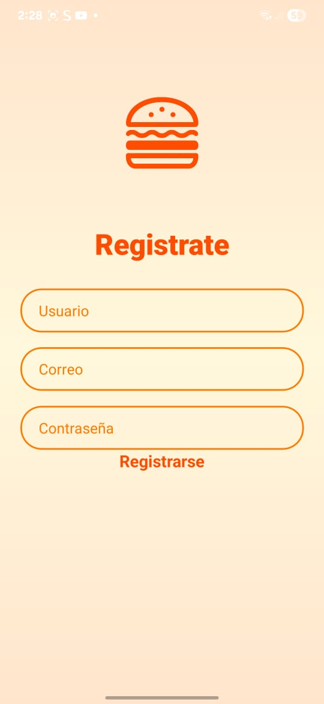

# 🍔🌭 Fast Food App

Aplicación de comida rápida enfocada en **hamburguesas** y **hot dogs**, desarrollada como proyecto escolar.  
El objetivo es simular una plataforma sencilla donde los usuarios puedan visualizar el menú, armar sus pedidos y conocer más sobre los productos.

---

## 🚀 Características

- Menú interactivo de hamburguesas y hot dogs.   
- Carrito de compras simulado.  
- Diseño responsivo y amigable.  
- Backend conectado a API (Node.js).  
- Navegación por pestañas: Inicio, Pedido, Favoritos y Perfil.  
- Pantallas de bienvenida y registro personalizadas.

## 🖼️ Vista previa




## 🧩 Estructura del proyecto

```
📦 client/
 ┣ 📂 assets/
 ┃ ┗ burger-icon.png
 ┣ 📂 components/
 ┣ 📂 src/
 ┃ ┣ 📂 navigation/
 ┃ ┃ ┗ MainTabs.js
 ┃ ┗ 📂 screens/
 ┃   ┣ FavoritosScreen.js
 ┃   ┣ InicioScreen.js
 ┃   ┣ PedidoScreen.js
 ┃   ┣ PerfilScreen.js
 ┃   ┣ RegisterScreen.js
 ┃   ┗ WelcomeScreen.js
 ┣ 📂 theme/
 ┣ .gitignore
 ┣ App.js

```

## 🧠 Tecnologías utilizadas

- **React Native** (interfaz principal)  
- **Expo Go** (entorno de desarrollo y pruebas)  
- **Node.js / Express** (para la API simulada)  
- **JavaScript (ES6)**  
- **CSS / NativeWind** (estilos visuales)

## ⚙️ Instalación y ejecución

1. Clona este repositorio:
   git clone https://github.com/AlfredoAD20/Fast-food

2. instala dependencias
**cd client**
**npm install**

3. inicia el servidor expo
**npx expo start** 

4. Escanea el QR en tu expo go

