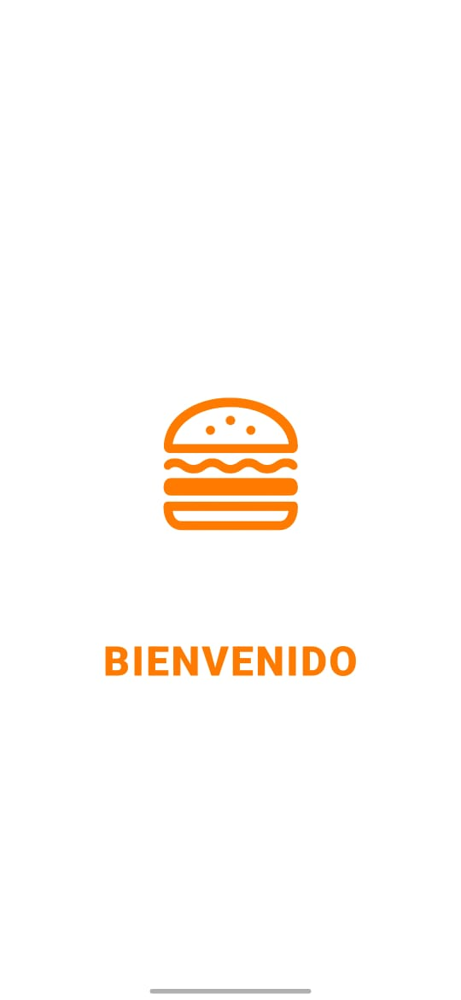
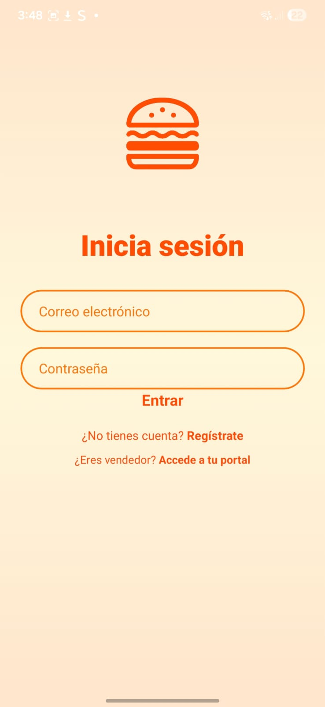
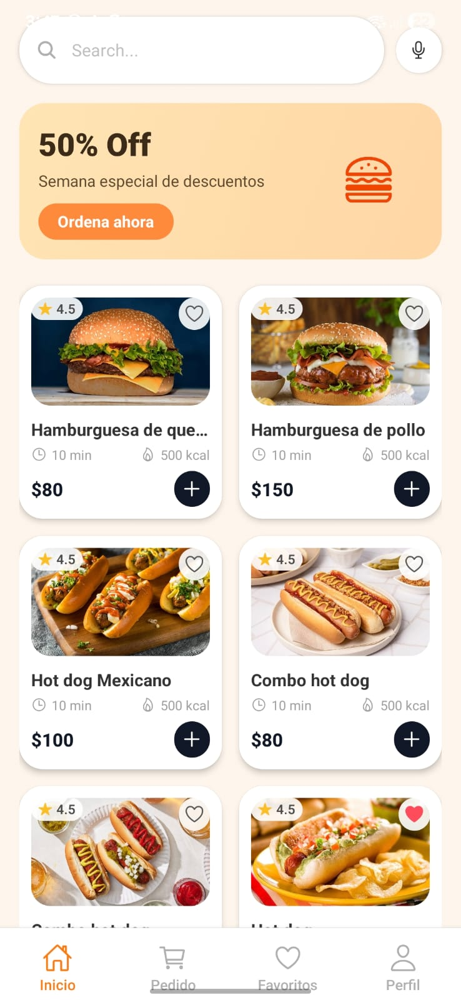

# 🍔🌭 Fast Food App

Aplicación de comida rápida enfocada en **hamburguesas** y **hot dogs**, desarrollada como proyecto escolar.  
Simula una plataforma real donde:

- Los usuarios pueden **registrarse, iniciar sesión, ver el menú, agregar al carrito y confirmar pedidos**.
- Un **administrador** puede iniciar sesión, **subir nuevos productos con foto** y gestionarlos desde un panel.

---

## 🚀 Características principales

- Menú interactivo de hamburguesas y hot dogs. 
- Carrito de compras simulado. 
- Diseño responsivo y amigable. 
- Backend conectado a API (Node.js). 
- Navegación por pestañas: Inicio, Pedido, Favoritos y Perfil. 
- Pantallas de bienvenida y registro personalizadas y portal de vendedores.

## 🖼️ Vista previa 

<div align="center"> 
 

 </div> 

> Las imágenes muestran las principales pantallas: **Bienvenida**, **Registro** e **Inicio**.

## Descargar APK

👉 [FastFood.apk](./apk/FastFood.apk)

### 👤 Para usuarios (clientes)

- Registro e inicio de sesión con **JWT**.
- Pantallas de:
  - **Bienvenida**
  - **Login / Registro**
  - **Inicio (menú)**
  - **Pedido (carrito)**
  - **Favoritos**
  - **Perfil**
- Menú de hamburguesas y hot dogs cargado desde el **backend (MongoDB)**.
- **Carrito real**:
  - Agregar / quitar unidades.
  - Ver total del pedido.
  - Confirmar pedido → se guarda en la base de datos.
- **Historial de pedidos** del usuario.
- Marca de productos como **favoritos** (corazoncito).

### Para administrador / vendedor

- Inicio de sesión con usuario que tenga `rol: "admin"`.
- Acceso a un **Panel de Vendedor**.
- Pantalla de **Agregar Producto**:
  - Nombre
  - Descripción
  - Precio
  - Categoría (`burger` | `hotdog`)
  - Foto del producto (subida con `multer`)
- Cuando el admin crea un producto, **aparece automáticamente en el Inicio** de los clientes.

### Diseño

- Pantalla de inicio con:
  - Barra de búsqueda con icono de lupa.
  - Tarjetas de producto con imagen, precio, tiempo estimado y calorías.
  - Botón **“+”** para agregar al carrito.
  - Corazón para marcar como favorito.
- Fondo en tonos **crema / blanco** y tarjetas con sombras suaves (estilo app moderna de comida).

---

## 🧱 Arquitectura general

El proyecto está dividido en **app móvil (frontend)** y **API (backend)**.

```bash
📦 Fast-food/
 ┣ 📂 backend/               # API Node.js + Express + MongoDB
 ┣ 📂 assets/                # Imágenes usadas en la app
 ┣ 📂 scr/
 ┃ ┣ 📂 auth/
 ┃ ┃ ┣ AuthContext.js
 ┃ ┃ ┣ index.js              # AuthStack (Login / Register / Login vendedor / Panel)
 ┃ ┣ 📂 navigation/
 ┃ ┃ ┣ MainTabs.js           # Tabs: Inicio, Pedido, Favoritos, Perfil
 ┃ ┃ ┗ PedidosStack.js       # Navegación de pedido e historial
 ┃ ┣ 📂 screens/
 ┃ ┃ ┣ WelcomeScreen.js
 ┃ ┃ ┣ LoginScreen.js
 ┃ ┃ ┣ RegisterScreen.js
 ┃ ┃ ┣ InicioScreen.js
 ┃ ┃ ┣ PedidoScreen.js
 ┃ ┃ ┣ HistorialPedidosScreen.js
 ┃ ┃ ┣ FavoritosScreen.js
 ┃ ┃ ┣ PerfilScreen.js
 ┃ ┃ ┣ LoginVendedorScreen.js
 ┃ ┃ ┗ VendedorPanelScreen.js
 ┃ ┗ CartContext.js          # Contexto de carrito y favoritos
 ┣ 📂 theme/
 ┣ App.js
 ┣ .env                      # URL de la API para la app
 ┗ ...

## 🧠 Tecnologías utilizadas

### Frontend (App móvil)

- React Native (con Expo)
- React Navigation (stacks + tabs)
- Context API (`AuthContext`, `CartContext`)
- `expo-linear-gradient`
- `@expo/vector-icons` (Ionicons)
- Manejo de variables de entorno con `@env`

### Backend (API)

- Node.js + Express
- MongoDB Atlas + Mongoose
- Multer (subida de imágenes)
- JWT (autenticación)
- bcryptjs (hash de contraseñas)
- dotenv (configuración de entorno)

---

## ⚙️ Instalación y ejecución

### 1️⃣ Clonar el repositorio

```bash
git clone https://github.com/AlfredoAD20/Fast-food.git
cd Fast-food
